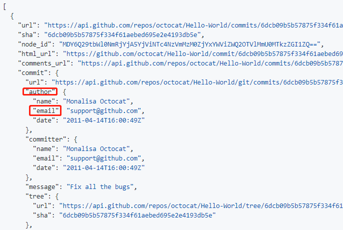

### Principle of checking whether a PR has signed a CLA

The unit of the robot to check CLA is commit. A PR contains one or more committs. When each commit of the PR passes the check, the PR also passes the CLA check.

There are two steps to check whether a single commit has signed the CLA.

Step 1: Obtain the email address of the commit's author.

Step 2: Verify the email address in the CLA system. If the verification is successful, it indicates that the commit has signed the CLA. Otherwise, the commit has not signed the CLA.


### View all the commits of a PR

Please access this [API](https://docs.github.com/en/rest/reference/pulls#list-commits-on-a-pull-request) to view all the commits of a PR.

The email address of a commit's author is shown in the picture below.




### What to do if a commit fails the CLA check?

First, make sure you have completed the CLA signing. If you are signing an employee CLA, make sure your CLA manager approves your signing.

Second, make sure that the email address of the author in each commit is correct and that the email address is as same as the one you filled in when you signed the CLA.

Last, if you are in one of the following scenarios, refer to the corresponding method.

#### 1. The email address configured in the commit is incorrect.

Incorrect email addresses include several cases, such as invalid email addresses, missing characters. If you submit the commit by `git push` command, perform the following steps to modify the commit.

Assume that the commits of a PR is as follows.

``` sh
# git log
commit ca82a6dff817ec66f44342007202690a93763949
Author: Scott Chacon <schacon@gee-mail.com>
Date:   Mon Mar 17 21:52:11 2008 -0700

    Change version number

commit 085bb3bcb608e1e8451d4b2432f8ecbe6306e7e7
Author: Scott Chacon <schacon@gee-mail.cm>
Date:   Sat Mar 15 16:40:33 2008 -0700

    Remove unnecessary test
```

In the second commit, the domain of email address misses a character 'o'. You can run the following command to change the email address of it.

``` sh
git rebase -i HEAD~2

git commit --amend --author="Scott Chacon <schacon@gee-mail.com>" --no-edit

git rebase --continue
```

After the modification, do not forget to run the `git push` command to submit the commit.

#### 2. The email address configured in commit has not been used to sign the CLA.

Please sign the cla and fill in this email when signing.

#### 3. The email of a commit submitted through the Github web page is an anonymous email address.

This is because the commit author did not expose his github email address. Please log in to your Github account and visit setting -> Emails，set "Primary email address", and don't choose "Keep my email addresses private".

For this kind of commit, one of methods to fix it is like this. First, pull the PR to the local environment. Second, modify the email of commit by referring to the method in the first scenario.

Refering the method below to pull the PR to local environment.

``` sh
git clone ${REPOSITORY_URL}
git fetch origin pull/${PULL_NUMBER}/head:${PULL_BASE_BRANCH}-${PULL_NUMBER}
```

PULL_BASE_BRANCH: It is the base branch name of PR.


### How to set the local developing environment

Please set the git by refering the following commands. Note: the email address is as same as the one you filled in when you signed the CLA.

``` sh
git config user.name [GITHUB ID]

git config user.email [EMAIL]
```

If you want to get more details about setting the git, here is an good [example](https://github.com/kubernetes/community/blob/master/contributors/guide/github-workflow.md)
