# signing 模块逻辑架构视图

> 基于 DDD（领域驱动设计）分层架构

```
┌─────────────────────────────────────────────────────────────────────────────────┐
│                           Adapter Layer（适配器层）                               │
│                                                                                   │
│  ┌────────────┐ ┌─────────────────┐ ┌──────────────────┐ ┌───────────────────┐  │
│  │CorpSigning │ │EmployeeSigning  │ │IndividualSigning │ │  User / CorpAdmin │  │
│  │  Adapter   │ │    Adapter      │ │    Adapter       │ │     Adapter       │  │
│  └──────┬─────┘ └───────┬─────────┘ └────────┬─────────┘ └─────────┬─────────┘  │
│         │               │                    │                     │            │
│  ┌──────┴───────────────┴────────────────────┴─────────────────────┴──────────┐ │
│  │            HTTP Request → Command / DTO → HTTP Response（参数转换）          │ │
│  └────────────────────────────────────────────────────────────────────────────┘ │
└──────────────────────────────────────┬──────────────────────────────────────────┘
                                       │ 调用
┌──────────────────────────────────────▼──────────────────────────────────────────┐
│                         Application Layer（应用层）                               │
│                                                                                   │
│  ┌────────────────┐  ┌─────────────────┐  ┌──────────────────┐  ┌─────────────┐ │
│  │CorpSigningSvc  │  │EmployeeSigningSvc│  │IndividualSigning │  │  UserSvc    │ │
│  │ Sign / Remove  │  │ Sign / Update    │  │ Svc              │  │ Login /     │ │
│  │ Get / List     │  │ List / Remove    │  │ Sign / AgreeNew  │  │ ChangePass  │ │
│  └───────┬────────┘  └────────┬────────┘  └────────┬─────────┘  └──────┬──────┘ │
│          │                   │                     │                   │        │
│  ┌───────┴───────────────────┴─────────────────────┴───────────────────┴──────┐  │
│  │            流程编排：验证码校验 → 聚合根操作 → 持久化 → 事件发送                │  │
│  └────────────────────────────────────────────────────────────────────────────┘  │
└──────────────────────────────────────┬──────────────────────────────────────────┘
                                       │ 调用
┌──────────────────────────────────────▼──────────────────────────────────────────┐
│                           Domain Layer（领域层）                                  │
│                                                                                   │
│  ┌──────────────── Aggregates（聚合根）───────────────────────────────────────┐   │
│  │                                                                           │   │
│  │  ┌───────────────────┐    ┌────────────────────┐    ┌─────────────────┐  │   │
│  │  │   CorpSigning AR  │    │  EmployeeSigning AR │    │IndividualSigning│  │   │
│  │  │ ┌───────────────┐ │    │ enable / disable   │    │AR               │  │   │
│  │  │ │ Representative│ │    │ remove             │    │ AgreeNewCLA()   │  │   │
│  │  │ │ (Entity)      │ │    └────────────────────┘    │ HasSignedCLA()  │  │   │
│  │  │ ├───────────────┤ │                              └─────────────────┘  │   │
│  │  │ │ Manager       │ │    ┌────────────────────┐    ┌─────────────────┐  │   │
│  │  │ │ (Entity)      │ │    │     User AR         │    │    Link AR      │  │   │
│  │  │ ├───────────────┤ │    │ ChangePassword()    │    │ AddCLA()        │  │   │
│  │  │ │ Corporation   │ │    │ UpdatePrivacy()      │    │ FindCLA()       │  │   │
│  │  │ │ (Entity)      │ │    └────────────────────┘    │ CanDo()         │  │   │
│  │  │ └───────────────┘ │                              └─────────────────┘  │   │
│  │  └───────────────────┘                                                   │   │
│  └───────────────────────────────────────────────────────────────────────────┘   │
│                                                                                   │
│  ┌──────── Domain Primitives（值对象 dp/）──────┐  ┌─── Domain Services ───────┐  │
│  │ Account  EmailAddr  CorpName  CLAType        │  │ UserService               │  │
│  │ Password  Language  Name  Title  URL         │  │ LoginService              │  │
│  └──────────────────────────────────────────────┘  │ CLAService                │  │
│                                                     │ VCService                 │  │
│  ┌──────── Domain Abstractions（领域接口）──────┐   │ AccessTokenService        │  │
│  │ Encryption   SymmetricEncryption            │   │ EmailCredentialService    │  │
│  │ RandomCode   RandomBytes                    │   └───────────────────────────┘  │
│  │ Limiter      Message   LocalCLA             │                                  │
│  │ UserPassword                                │                                  │
│  └──────────────────────────────────────────────┘                                 │
│                                                                                   │
│  ┌──────── Repository Interfaces（仓储接口 domain/repository/）────────────────┐   │
│  │  UserRepo  CorpSigningRepo  IndividualSigningRepo  LinkRepo                │   │
│  │  AccessTokenRepo  LoginRepo  VerificationCodeRepo  EmailCredentialRepo     │   │
│  └────────────────────────────────────────────────────────────────────────────┘  │
└──────────────────────────────────────┬──────────────────────────────────────────┘
                         实现（依赖倒置）│
┌──────────────────────────────────────▼──────────────────────────────────────────┐
│                       Infrastructure Layer（基础设施层）                           │
│                                                                                   │
│  ┌─────── Repository Impl（repositoryimpl/）────────────────────────────────┐    │
│  │                                                                          │    │
│  │  ┌──────────────────────────┐     ┌───────────────────────────────────┐  │    │
│  │  │       MongoDB            │     │           Redis                   │  │    │
│  │  │  CorpSigning (+ Cache)   │     │  AccessToken  Login               │  │    │
│  │  │  User                    │     │  VerificationCode                 │  │    │
│  │  │  IndividualSigning       │     └───────────────────────────────────┘  │    │
│  │  │  Link                    │                                            │    │
│  │  │  EmailCredential         │     ┌───────────────────────────────────┐  │    │
│  │  └──────────────────────────┘     │      Local FileSystem             │  │    │
│  │                                   │  LocalCLA (PDF 文件)               │  │    │
│  └───────────────────────────────────┴────────────────────────────────────┘    │
│                                                                                   │
│  ┌──────── Service Impl（*impl/）──────────────────────────────────────────────┐  │
│  │  encryptionimpl    symmetricencryptionimpl    passwordimpl                  │  │
│  │  randomcodeimpl    randombytesimpl            limiterimpl (Redis)           │  │
│  │  messageimpl (Kafka)   smtpimpl   emailtmpl   localclaimpl                  │  │
│  └─────────────────────────────────────────────────────────────────────────────┘  │
└────────────────────────────────────────────────────────────────────────────────────┘
                                       │
┌──────────────────────────────────────▼──────────────────────────────────────────┐
│                         Watch Layer（事件观察层）                                  │
│                                                                                   │
│   CLA Updated Event → messageimpl (Kafka) → NotifyCorpAdmins → SMTP Email       │
└─────────────────────────────────────────────────────────────────────────────────┘
```

---

## 各层职责说明

| 层 | 目录 | 核心职责 |
|---|---|---|
| Adapter | `signing/adapter/` | HTTP 请求解析、参数转 Command、DTO 转响应 |
| Application | `signing/app/` | 业务流程编排，不含业务规则 |
| Domain | `signing/domain/` | 业务规则、聚合根、值对象、仓储接口 |
| Infrastructure | `signing/infrastructure/` | MongoDB/Redis/SMTP/Kafka 的技术实现 |
| Watch | `signing/watch/` | CLA 变更事件驱动、异步通知 |

---

## 关键设计特点

1. **依赖倒置**：Domain 层定义接口（Repository、Encryption 等），Infrastructure 层实现，外层依赖内层抽象
2. **值对象防腐**：所有业务参数在边界处构造为 `dp/` 下的值对象，验证逻辑内聚
3. **双存储策略**：业务数据 → MongoDB，临时状态（Token/VC/登录失败）→ Redis
4. **聚合根边界**：5 个 AR 各自封装业务规则，通过 Repository 接口与外部解耦

---

## 主要聚合根

| 聚合根 | 职责 |
|---|---|
| `CorpSigning` | 公司签署 CLA，含代表、经理、员工等子实体 |
| `EmployeeSigning` | 员工签署记录，归属于某个 CorpSigning |
| `IndividualSigning` | 个人开发者签署 CLA |
| `User` | 系统用户，负责认证和密码管理 |
| `Link` | CLA 文档链接，管理 CLA 版本 |

---

## 核心业务流程

### 公司签署 CLA

```
HTTP POST /corp-signing
  → CorpSigningAdapter（参数校验，构造 Command）
  → app.CorpSigningService.Sign()
      ├─ VCService.Verify()（验证码校验）
      ├─ new CorpSigning AR（聚合根创建，触发业务规则）
      ├─ CorpSigningRepo.Add()（MongoDB 持久化）
      └─ watch.SendCLAUpdatedEvent()（发送 Kafka 事件）
  → HTTP 200 Response
```

### 用户登录

```
HTTP POST /user/login
  → UserAdapter
  → app.UserService.Login()
      ├─ LoginService.LoginByAccount()（查询 + 失败计数 Redis）
      ├─ Encryption.Compare()（密码验证）
      └─ AccessTokenService.New()（生成 Token → Redis）
  → HTTP 200 + Token
```

---

## Mermaid 架构图

```mermaid
graph TB
    subgraph AL["Adapter Layer（适配器层）"]
        direction LR
        A1["CorpSigning Adapter"]
        A2["EmployeeSigning Adapter"]
        A3["IndividualSigning Adapter"]
        A4["User / CorpAdmin Adapter"]
    end

    subgraph APP["Application Layer（应用层）"]
        direction LR
        AP1["CorpSigningSvc\nSign / Remove / List"]
        AP2["EmployeeSigningSvc\nSign / Update / List"]
        AP3["IndividualSigningSvc\nSign / AgreeNew"]
        AP4["UserSvc\nLogin / ChangePass"]
    end

    subgraph DL["Domain Layer（领域层）"]
        subgraph AGG["Aggregates（聚合根）"]
            direction LR
            D1["CorpSigning AR\n└ Representative\n└ Manager\n└ Corporation"]
            D2["EmployeeSigning AR\nenable / disable / remove"]
            D3["IndividualSigning AR\nAgreeNewCLA / HasSignedCLA"]
            D4["User AR\nChangePassword / UpdatePrivacy"]
            D5["Link AR\nAddCLA / FindCLA / CanDo"]
        end

        DP["Domain Primitives dp/（值对象）\nAccount · EmailAddr · CorpName · CLAType\nPassword · Language · Name · Title · URL"]

        DS["Domain Services\nUserService · LoginService · CLAService\nVCService · AccessTokenService · EmailCredentialService"]

        DA["Domain Abstractions（领域接口）\nEncryption · SymmetricEncryption · RandomCode\nRandomBytes · Limiter · Message · LocalCLA · UserPassword"]

        RI["Repository Interfaces domain/repository/\nUserRepo · CorpSigningRepo · IndividualSigningRepo · LinkRepo\nAccessTokenRepo · LoginRepo · VerificationCodeRepo · EmailCredentialRepo"]
    end

    subgraph IL["Infrastructure Layer（基础设施层）"]
        direction LR
        MongoDB["MongoDB\nCorpSigning + Cache · User\nIndividualSigning · Link · EmailCredential"]
        Redis["Redis\nAccessToken · Login · VerificationCode"]
        LocalFS["Local FileSystem\nLocalCLA PDF"]
        SImpl["Service Impl\nencryptionimpl · symmetricencryptionimpl · passwordimpl\nrandomcodeimpl · limiterimpl · messageimpl·Kafka\nsmtpimpl · emailtmpl · localclaimpl"]
    end

    subgraph WL["Watch Layer（事件观察层）"]
        Watch["CLA Updated Event → Kafka → NotifyCorpAdmins → SMTP Email"]
    end

    AL      -->|"HTTP Request → Command"| APP
    APP     -->|"业务流程编排"| DL
    DL      -.->|"依赖倒置实现"| IL
    APP     -->|"CLA 变更触发"| WL
    WL      -.->|"消息发送"| IL
```


